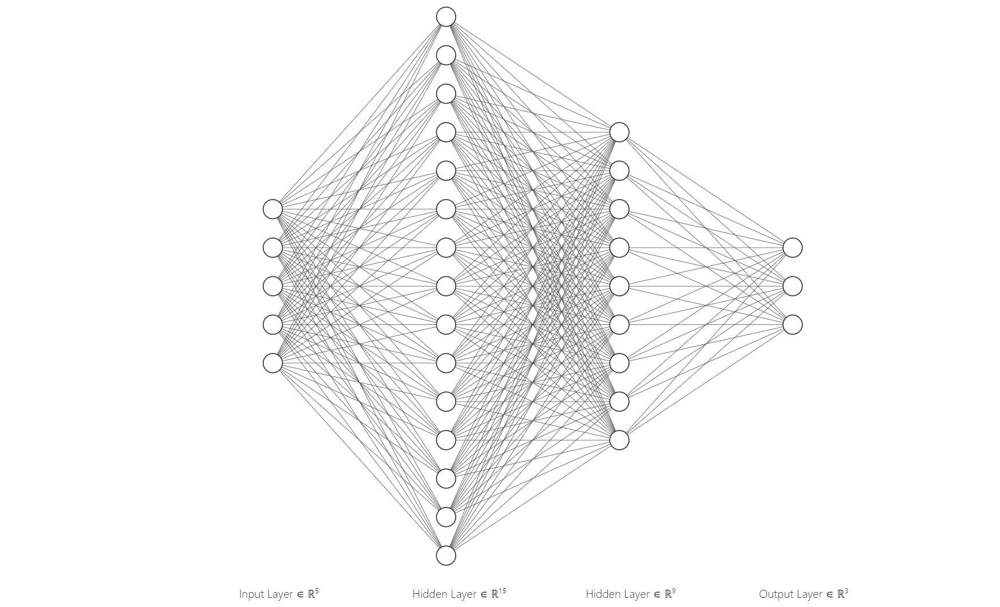

# Deep Drone
# Intoduction 
Airsim	is	a	simulator	for	drones,	cars	and	more,	built	on	Unreal	Engine.	It	is	opensource,	cross	platform,	and	supports	hardware-in-loop	with	popular	flight	controllers such	as	PX4	for	physically	and	visually	realistic	simulations.	It	is	developed	as	an	Unreal	
plugin	that	can	simply	be	dropped	into	any	Unreal	environment.	Airsim's	goal	is	to	
develop	AirSim	as	a	platform	for	AI	research	to	experiment	with	deep	learning,	computer	
vision	and	reinforcement	learning	algorithms	for	autonomous	vehicles.	For	this	purpose,	
AirSim	also	exposes	APIs	to	retrieve	data	and	control	vehicles	in	a	platform	independent	
way.	

# youtube Video:

# The	Challenge

We	want	to	fly	a	drone	autonomously	and	without	GPS.	for	that	we	made	a	diffrent
algorithm's	such	as	fly	close	to	one	wall	;	fly	close	to	two	walls	,	hover	,	emergency
break	;	and	more	,	the	ML	part	is	to	choose	the	right	algorithm	for	the	current	situation.
that	is	a	classification	problem	to	classify	the	wanted	state	based	on	the	lidars	data.

# The Data

The	data	is	a	log	file	from	the	drone	that	contains	the	drone	telemetry	and	the	lidars
(ranges	to	different	directions	)	and	the	wanted	state	that	human	choose	by	vision	for
the	current	situation.
notice	that	the	most	right	column	is	the	one	we	want	to	predict.

# The states 
### safe - the Drone can fly fast, no near obstacles detected relative to the drone speed.
### normal - fly with caution because there are near obstacles.
### emergency - need to make an immediate change in order not to crush.

# The neural network Architecture: (5->15->9->3)

# Data sample

# Show how the data was created.

# How ro run :

### jupyter
open the ipynb in jupyter and run all cells.

### colab
open this colab notebook : https://colab.research.google.com/drive/190B5cq1sIAHbRchVZ8eZFT8YUaL5pKxI?usp=sharing

# Summary 

The nn works better even with the same number of epochs 
from 5,000 and beyond in my case.
Also, Adam Optimizer dramatically increased the learning speed.
one more thing I learned is it's very important to use softmax_cross_entropy_with_logits_v2 instead of the croos_entropy because I had a numerical issue with cross_entropy.

Iteration: 899900  loss: 0.020082667
accuracy is : 0.971564

The best accuracy I achieved is: 0.971564 witch is not bad in my opinion. 
 

